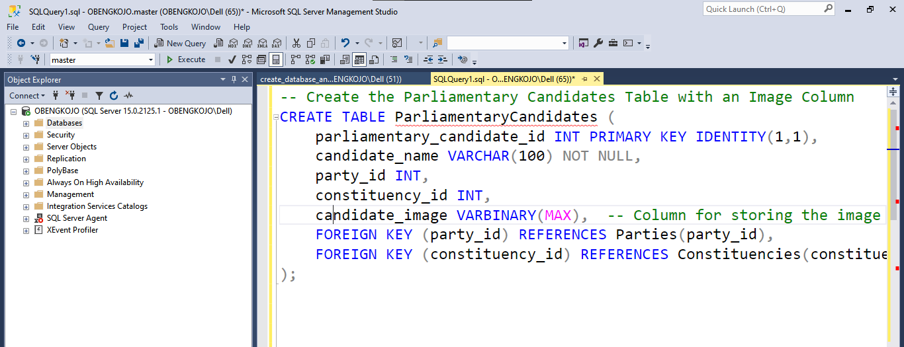
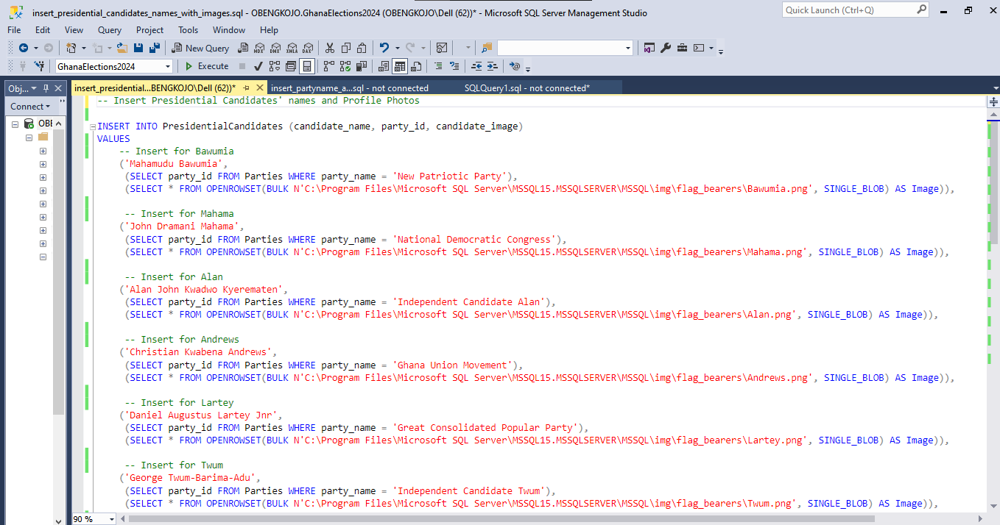
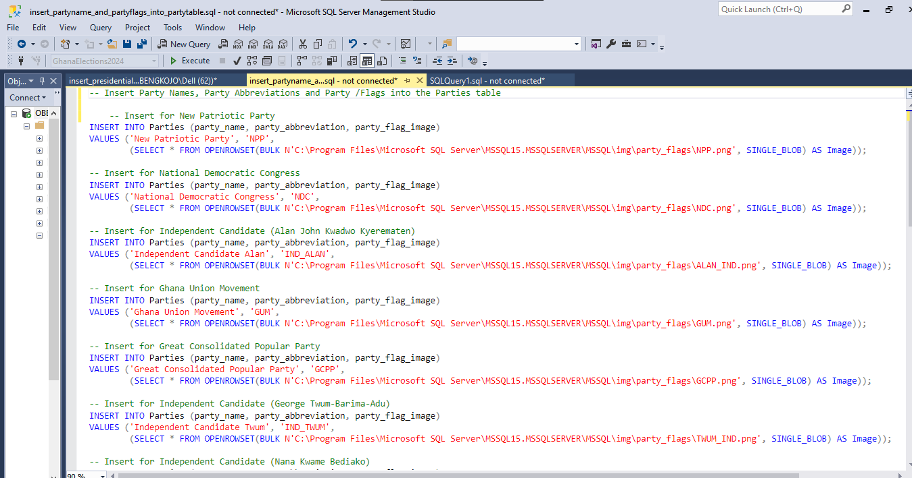

# Ghana Election 2024 Database Project

### Modelling of a Database in SQL Server Management Studio (SSMS)🖥️ for the 2024 Presidential and Parliamentary Election in Ghana

## Overview 🌍
This project demonstrates the design and implementation of a fully normalized relational database for the Ghana 2024 elections. The database is modeled to store and organize data related to regions, constituencies, polling stations, political parties, candidates, and votes. The objective is to illustrate best practices in database design, specifically normalization, within SQL Server Management Studio (SSMS).

## Key Objectives 🔑
- Model a normalized database for an election system.
- Use SSMS to create efficient table structures that minimize redundancy.
- Store data for regional hierarchies, candidate details, and voting results.
- Integrate multimedia support to store images for political parties and candidates.

## Skills Learned 🧠

- **Database Design** – Structured databases with fully normalized tables for efficient data organization.
- **Data Modeling** – Created logical and physical models for relational databases, including ER diagrams.
- **SQL Querying** – Wrote SQL commands for creating tables, inserting data, and linking tables.
- **Data Normalization** – Applied principles to eliminate redundancy and ensure consistency in tables.
- **Relational Database Management** – Structured relationships between tables to maintain data integrity.
- **Binary Large Object (BLOB) Storage** – Stored images in SQL databases.
- **Database Integrity and Referential Constraints** – Defined primary and foreign keys for data consistency.
- **Performance Optimization** – Structured data for efficient querying and storage.
- **Project Documentation** – Wrote clear and structured documentation for database usage.
- **Data Handling and Importing** – Utilized `OPENROWSET` and similar functions for importing external files.
- **Database Troubleshooting and Error Handling** – Debugged common SQL command issues and error messages.
  
## Tools and Technologies Used 🛠 

- **GitHub**: For version control and collaboration on project files, including sharing codes and documentation.
- **Photoshop**: For creating and editing images, including the design of any graphics or visuals used in the project.
- **SQL Server Management Studio (SSMS)**: For building, managing and querying the election database.


## How to Run This Project 🚀 

1. **Clone the Repository**  
   Run the following command to clone the repository to your local machine:
   ```bash
   git clone https://github.com/ObengKojo23/Ghana-Election-2024-Database-Project.git
   
2. **Download SQL Server Management Studio (SSMS)**  
You can download SQL Server Management Studio (SSMS) from the official Microsoft website: [Download SSMS](https://learn.microsoft.com/en-us/sql/ssms/download-sql-server-management-studio-ssms).

3. Launch SSMS application and follow along to achieve similar outcome

# Steps

## 1. Database Creation ⚙️
Launch the `SSMS` application and click on `New Query` to open the query editor window. 

Use the following SQL command to create a `database`:

A screenshot of the SQL command I used to create the database


An alt text you can copy and use.
```sql

CREATE DATABASE GhanaElection2024;

```
This creates the database called `GhanaElection2024` and sets it as the active database for subsequent table creation.


## Database Structure

### Thought Process
The database is designed with full normalization in mind and the aim to reduce redundancy and ensure that each table stores information about a single entity or relationship. Key entities include Regions, Constituencies, PollingStations, Parties, PresidentialCandidates, ParliamentaryCandidates, and Votes. The normalization process is detailed below:

- **First Normal Form (1NF):** Ensures each column contains atomic values.
- **Second Normal Form (2NF):** Removes partial dependencies, where non-key attributes depend on the entire primary key.
- **Third Normal Form (3NF):** Eliminates transitive dependencies by making sure that all non-key attributes depend only on the primary key.

## 2. Create Database Tables 🗄️

### 2.1 Regions Table
This table stores data about Ghana's regions, with each region assigned a unique regional ID (`region_id`).

A screenshot of the SQL command I used to create the `Regions Table`


An alt text you can copy and use.

```sql
CREATE TABLE Regions (
    region_id INT PRIMARY KEY IDENTITY(1,1),
    region_name VARCHAR(100) NOT NULL
);
```

**Code Explanation**

**`CREATE TABLE Regions`:**
- This line creates a table named `Regions`.
- The table will hold information related to Ghana's regions, such as unique identifier and region names.

**`region_id INT PRIMARY KEY IDENTITY(1,1)`:**
- `region_id`: This column will serve as the unique identifier for each region.
- `INT`: Specifies that `region_id` is of integer data type, which is appropriate for storing numerical values.
- `PRIMARY KEY`: Designates `region_id` as the primary key for the table. This ensures that each entry in the `Regions` table is unique and can be individually accessed.
- `IDENTITY(1,1)`:
  - This keyword is specific to SQL Server and is used to create an auto-incrementing column.
  - The first `1` sets the initial value of `region_id` to 1.
  - The second `1` means that each new entry will increment `region_id` by 1, ensuring a unique ID for every new region added to the table.

**`region_name VARCHAR(100) NOT NULL`:**
- `region_name`: This column stores the name of each region in Ghana.
- `VARCHAR(100)`: This specifies that `region_name` can store variable-length character data, with a maximum of 100 characters. `VARCHAR` is efficient as it only uses as much storage as necessary based on the actual length of the text.
- `NOT NULL`: This constraint ensures that every entry in the `region_name` column must have a value. It prevents regions from being added without a specified name, which is critical for data completeness and consistency.

**Summary:**
This table design serves as a foundational part of the database, as each region in Ghana will be assigned a unique `region_id`, and its name will be stored in `region_name`. This setup enables efficient referencing for regions in other tables through `region_id`, supporting normalized and relational database practices.


### 2.2 Constituencies Table
This table links constituencies to regions and includes information on voter populations.

A screenshot of the SQL command I used to create the `Constituencies Table`


An alt text you can copy and use.
```sql
CREATE TABLE Constituencies (
    constituency_id INT PRIMARY KEY IDENTITY(1,1),
    constituency_name VARCHAR(100) NOT NULL,
    region_id INT,
    total_voters INT,
    FOREIGN KEY (region_id) REFERENCES Regions(region_id)
);
```
**Code Explanation**

**`CREATE TABLE Constituencies`:**
- This command initiates the creation of a table called `Constituencies`, which will store information about constituencies in Ghana.

**`constituency_id INT PRIMARY KEY IDENTITY(1,1)`:**
- `constituency_id`: Serves as a unique identifier for each constituency.
- `INT`: Sets the data type as integer.
- `PRIMARY KEY`: Ensures each constituency has a unique ID.
- `IDENTITY(1,1)`: This auto-increments `constituency_id`, starting at 1 and increasing by 1 with each new entry.

**`constituency_name VARCHAR(100) NOT NULL`:**
- `constituency_name`: Stores the name of each constituency.
- `VARCHAR(100)`: Allows variable-length text with a maximum of 100 characters.
- `NOT NULL`: Ensures every constituency has a name.

**`region_id INT`**:
- `region_id`: References the region in which the constituency is located, linking to the `Regions` table.

**`total_voters INT`**:
- `total_voters`: Stores the total number of registered voters in each constituency.

**`FOREIGN KEY (region_id) REFERENCES Regions(region_id)`:**
- This establishes a foreign key constraint, linking each constituency to a specific region by `region_id`.

**Summary:**
The `Constituencies` table organizes constituencies by assigning each a unique `constituency_id`, storing its name, associated region, and total voter count. This structure supports relationships with the `Regions` table and ensures efficient data organization.

### 2.3 PollingStations Table
This table organizes polling stations within constituencies, with each station assigned a code.

A screenshot of the SQL command I used to create the `PollingStations Table`


An alt text you can copy and use.
```sql
CREATE TABLE PollingStations (
    polling_station_id INT PRIMARY KEY IDENTITY(1,1),
    polling_station_code VARCHAR(20) NOT NULL,
    polling_station_name VARCHAR(100) NOT NULL,
    constituency_id INT,
    FOREIGN KEY (constituency_id) REFERENCES Constituencies(constituency_id)
);
```

**Code Explanation**

**`CREATE TABLE PollingStations`:**
- This command creates a table named `PollingStations`, which will store data about polling stations within each constituency.

**`polling_station_id INT PRIMARY KEY IDENTITY(1,1)`:**
- `polling_station_id`: Serves as the unique identifier for each polling station.
- `INT`: Defines the data type as integer.
- `PRIMARY KEY`: Ensures that each polling station has a unique identifier.
- `IDENTITY(1,1)`: Sets `polling_station_id` to auto-increment, beginning at 1 and increasing by 1 with each new entry.

**`polling_station_code VARCHAR(20) NOT NULL`:**
- `polling_station_code`: Stores a unique code for each polling station, up to 20 characters.
- `VARCHAR(20)`: Allows variable-length character data, with a maximum of 20 characters.
- `NOT NULL`: Ensures every polling station has a unique code.

**`polling_station_name VARCHAR(100) NOT NULL`:**
- `polling_station_name`: Stores the name of each polling station.
- `VARCHAR(100)`: Allows variable-length text, with a maximum of 100 characters.
- `NOT NULL`: Ensures every polling station has a name.

**`constituency_id INT`**:
- `constituency_id`: References the constituency in which the polling station is located, linking it to the `Constituencies` table.

**`FOREIGN KEY (constituency_id) REFERENCES Constituencies(constituency_id)`:**
- Creates a foreign key constraint, associating each polling station with a specific constituency by `constituency_id`.

**Summary:**
The `PollingStations` table organizes polling station voting data by assigning a unique ID, code, and name for each station, with a reference to its respective constituency. This structure supports relationships with the `Constituencies` table and ensures data consistency across tables.


### 2.4 Parties Table
This table holds information on the 13 political parties, including a column for each party’s flag image or symbol of identity.

A screenshot of the SQL command I used to create the `Parties Table`


An alt text you can copy and use.
```sql
CREATE TABLE Parties (
    party_id INT PRIMARY KEY IDENTITY(1,1),
    party_name VARCHAR(100) NOT NULL,
    party_abbreviation VARCHAR(10) NOT NULL,
    party_flag_image VARBINARY(MAX)
);
```
**Code Explanation**

**`CREATE TABLE Parties`:**
- This command creates a table named `Parties`, which will store information about political parties participating in the elections.

**`party_id INT PRIMARY KEY IDENTITY(1,1)`:**
- `party_id`: Serves as the unique identifier for each political party.
- `INT`: Specifies the data type as an integer.
- `PRIMARY KEY`: Ensures that each party has a unique identifier.
- `IDENTITY(1,1)`: Sets `party_id` to auto-increment, starting at 1 and increasing by 1 for each new entry.

**`party_name VARCHAR(100) NOT NULL`:**
- `party_name`: Stores the full name of the political party.
- `VARCHAR(100)`: Allows variable-length character data, with a maximum length of 100 characters.
- `NOT NULL`: Ensures that every party must have a name.

**`party_abbreviation VARCHAR(10) NOT NULL`:**
- `party_abbreviation`: Stores a short form or acronym of the political party's name.
- `VARCHAR(10)`: Allows variable-length text, with a maximum of 10 characters.
- `NOT NULL`: Ensures every party has an abbreviation.

**`party_flag_image VARBINARY(MAX)`:**
- `party_flag_image`: Stores the binary data for the political party’s flag image.
- `VARBINARY(MAX)`: Allows storage of variable-length binary data, accommodating images of different sizes.

**Summary:**
The `Parties` table is structured to hold essential details about political parties, including unique identification, names, abbreviations, and images of their flags. This design facilitates easy retrieval and management of party information in relation to the election database.

### 2.5 PresidentialCandidates Table
This table is dedicated to the 13 presidential candidates and will store their details and a profile picture for each candidate.

A screenshot of the SQL command I used to create the `PresidentialCandidates Table`


An alt text you can copy and use.
```sql
CREATE TABLE PresidentialCandidates (
    presidential_candidate_id INT PRIMARY KEY IDENTITY(1,1),
    candidate_name VARCHAR(100) NOT NULL,
    party_id INT,
    candidate_image VARBINARY(MAX),
    FOREIGN KEY (party_id) REFERENCES Parties(party_id)
);
```

**Code Explanation**

**`CREATE TABLE PresidentialCandidates`:**
- This command creates a table named `PresidentialCandidates`, designed to store information about candidates running for the presidency.

**`presidential_candidate_id INT PRIMARY KEY IDENTITY(1,1)`:**
- `presidential_candidate_id`: Acts as the unique identifier for each presidential candidate.
- `INT`: Specifies that the data type is an integer.
- `PRIMARY KEY`: Ensures that each candidate has a unique identifier.
- `IDENTITY(1,1)`: Sets `presidential_candidate_id` to auto-increment, starting at 1 and increasing by 1 for each new entry.

**`candidate_name VARCHAR(100) NOT NULL`:**
- `candidate_name`: Stores the full name of the presidential candidate.
- `VARCHAR(100)`: Allows for variable-length character data with a maximum length of 100 characters.
- `NOT NULL`: Ensures that every candidate must have a name.

**`party_id INT`:**
- `party_id`: References the political party to which the candidate belongs.
- `INT`: Specifies the data type as an integer.

**`candidate_image VARBINARY(MAX)`:**
- `candidate_image`: Stores the binary data for the candidate's image.
- `VARBINARY(MAX)`: Allows for variable-length binary data, accommodating images of varying sizes.

**`FOREIGN KEY (party_id) REFERENCES Parties(party_id)`:**
- This establishes a foreign key relationship, linking `party_id` in the `PresidentialCandidates` table to the `party_id` in the `Parties` table. It ensures that each candidate is associated with a valid political party.

**Summary:**
The `PresidentialCandidates` table is structured to hold crucial information about presidential candidates, including unique identification, names, party affiliations, and images. This design facilitates effective management and retrieval of candidate data within the election database.


### 2.6 ParliamentaryCandidates Table
This table manages parliamentary candidates and links each candidate to their respective constituency.

A screenshot of the SQL command I used to create the `ParliamentaryCandidates Table`


An alt text you can copy and use.
```sql
CREATE TABLE ParliamentaryCandidates (
    parliamentary_candidate_id INT PRIMARY KEY IDENTITY(1,1),
    candidate_name VARCHAR(100) NOT NULL,
    party_id INT,
    constituency_id INT,
    candidate_image VARBINARY(MAX),
    FOREIGN KEY (party_id) REFERENCES Parties(party_id),
    FOREIGN KEY (constituency_id) REFERENCES Constituencies(constituency_id)
);
```
**Code Explanation**

**`CREATE TABLE ParliamentaryCandidates`:**
- This command creates a table named `ParliamentaryCandidates`, designed to store information about candidates running for parliamentary seats.

**`parliamentary_candidate_id INT PRIMARY KEY IDENTITY(1,1)`:**
- `parliamentary_candidate_id`: Serves as the unique identifier for each parliamentary candidate.
- `INT`: Specifies the data type as an integer.
- `PRIMARY KEY`: Ensures that each candidate has a unique identifier.
- `IDENTITY(1,1)`: Configures `parliamentary_candidate_id` to auto-increment, starting at 1 and increasing by 1 for each new entry.

**`candidate_name VARCHAR(100) NOT NULL`:**
- `candidate_name`: Stores the full name of the parliamentary candidate.
- `VARCHAR(100)`: Allows for variable-length character data with a maximum length of 100 characters.
- `NOT NULL`: Ensures that every candidate must have a name.

**`party_id INT`:**
- `party_id`: References the political party associated with the candidate.
- `INT`: Specifies the data type as an integer.

**`constituency_id INT`:**
- `constituency_id`: References the constituency in which the candidate is contesting.
- `INT`: Specifies the data type as an integer.

**`candidate_image VARBINARY(MAX)`:**
- `candidate_image`: Stores the binary data for the candidate's image.
- `VARBINARY(MAX)`: Allows for variable-length binary data, accommodating images of varying sizes.

**`FOREIGN KEY (party_id) REFERENCES Parties(party_id)`:**
- This establishes a foreign key relationship, linking `party_id` in the `ParliamentaryCandidates` table to the `party_id` in the `Parties` table. It ensures that each candidate is associated with a valid political party.

**`FOREIGN KEY (constituency_id) REFERENCES Constituencies(constituency_id)`:**
- This establishes a foreign key relationship, linking `constituency_id` in the `ParliamentaryCandidates` table to the `constituency_id` in the `Constituencies` table. It ensures that each candidate represents a valid constituency.

**Summary:**
The `ParliamentaryCandidates` table is structured to hold essential information about parliamentary candidates, including unique identification, names, party affiliations, constituency representation, and images. This design facilitates efficient management and retrieval of candidate data within the election database.


### 2.7 Votes Tables
These tables track votes for each candidate within each polling station.


#### 2.7.1 PresidentialVotes Table

A screenshot of the SQL command I used to create the `PresidentialVotes Table`


An alt text you can copy and use.
```sql
CREATE TABLE PresidentialVotes (
    vote_id INT PRIMARY KEY IDENTITY(1,1),
    polling_station_id INT,
    presidential_candidate_id INT,
    votes INT,
    FOREIGN KEY (polling_station_id) REFERENCES PollingStations(polling_station_id),
    FOREIGN KEY (presidential_candidate_id) REFERENCES PresidentialCandidates(presidential_candidate_id)
);
```
**Code Explanation**

**`CREATE TABLE PresidentialVotes`:**
- This command creates a table named `PresidentialVotes`, designed to store the voting results for presidential candidates.

**`vote_id INT PRIMARY KEY IDENTITY(1,1)`:**
- *`vote_id`: Serves as the unique identifier for each vote record.
- `INT`: Specifies the data type as an integer.
- `PRIMARY KEY`: Ensures that each vote record has a unique identifier.
- `IDENTITY(1,1)`: Configures `vote_id` to auto-increment, starting at 1 and increasing by 1 for each new entry.

**`polling_station_id INT`:**
- `polling_station_id`: References the polling station where the votes were cast.
- `INT`: Specifies the data type as an integer.

**`presidential_candidate_id INT`:**
- `presidential_candidate_id`: References the presidential candidate receiving the votes.
- `INT`: Specifies the data type as an integer.

**`votes INT`:
- `votes`: Stores the total number of votes received by the candidate at the polling station.
- `INT`: Specifies the data type as an integer.

**`FOREIGN KEY (polling_station_id) REFERENCES PollingStations(polling_station_id)`:**
- This establishes a foreign key relationship, linking `polling_station_id` in the `PresidentialVotes` table to the `polling_station_id` in the `PollingStations` table. It ensures that each vote record is associated with a valid polling station.

**`FOREIGN KEY (presidential_candidate_id) REFERENCES PresidentialCandidates(presidential_candidate_id)`:**
- This establishes a foreign key relationship, linking `presidential_candidate_id` in the `PresidentialVotes` table to the `presidential_candidate_id` in the `PresidentialCandidates` table. It ensures that each vote record corresponds to a valid presidential candidate.

**Summary:**
The `PresidentialVotes` table is structured to efficiently manage and record voting results for presidential candidates, including unique identification, associated polling stations, candidate references, and the number of votes received. This design supports accurate tracking of electoral results within the election database.


#### 2.7.2 ParliamentaryVotes Table
A screenshot of the SQL command I used to create the `ParliamentaryVotes Table`


An alt text you can copy and use.
```sql
CREATE TABLE ParliamentaryVotes (
    vote_id INT PRIMARY KEY IDENTITY(1,1),
    polling_station_id INT,
    parliamentary_candidate_id INT,
    votes INT,
    FOREIGN KEY (polling_station_id) REFERENCES PollingStations(polling_station_id),
    FOREIGN KEY (parliamentary_candidate_id) REFERENCES ParliamentaryCandidates(parliamentary_candidate_id)
);
```
**Code Explanation**

**`CREATE TABLE ParliamentaryVotes`:**
- This command creates a table named `ParliamentaryVotes`, which is intended to store the voting results for parliamentary candidates.

**`vote_id INT PRIMARY KEY IDENTITY(1,1)`:**
- `vote_id`: Serves as the unique identifier for each vote record.
- `INT`: Specifies the data type as an integer.
- `PRIMARY KEY`: Ensures that each vote record has a unique identifier.
- `IDENTITY(1,1)`: Configures `vote_id` to auto-increment, starting at 1 and increasing by 1 for each new entry.

**`polling_station_id INT`:**
- `polling_station_id`: References the polling station where the votes were cast.
- `INT`: Specifies the data type as an integer.

**`parliamentary_candidate_id INT`:**
- `parliamentary_candidate_id`: References the parliamentary candidate receiving the votes.
- `INT`: Specifies the data type as an integer.

**`votes INT`:**
- `votes`: Stores the total number of votes received by the candidate at the polling station.
- `INT`: Specifies the data type as an integer.

**`FOREIGN KEY (polling_station_id) REFERENCES PollingStations(polling_station_id)`:**
- This establishes a foreign key relationship, linking `polling_station_id` in the `ParliamentaryVotes` table to the `polling_station_id` in the `PollingStations` table. It ensures that each vote record is associated with a valid polling station.

**`FOREIGN KEY (parliamentary_candidate_id) REFERENCES ParliamentaryCandidates(parliamentary_candidate_id)`:**
- This establishes a foreign key relationship, linking `parliamentary_candidate_id` in the `ParliamentaryVotes` table to the `parliamentary_candidate_id` in the `ParliamentaryCandidates` table. It ensures that each vote record corresponds to a valid parliamentary candidate.

**Summary:**
The `ParliamentaryVotes` table is structured to effectively manage and record voting results for parliamentary candidates, including unique identification, associated polling stations, candidate references, and the number of votes received. This design facilitates accurate tracking of electoral results within the election database.

## 3. Database Diagramming 
This structure provides a clear view of how data entities relate and interact within the `GhanaElections2024` database.

A screenshot of the Database Diagram showing the relationship between all tables.


Below are the detail explanation of the primary-foreign key relationships, that was established in a database diagram in SSMS. Each relationship indicates a foreign key connection between tables and ensures that referential integrity is maintained.

### Foreign Key Connections

1. **Constituencies → Regions**
   - **Foreign Key**: `region_id`
   - **Description**: Links each constituency to a specific region in the `Regions` table.

2. **PollingStations → Constituencies**
   - **Foreign Key**: `constituency_id`
   - **Description**: Connects polling stations to their designated constituency in the `Constituencies` table.

3. **PresidentialCandidates → Parties**
   - **Foreign Key**: `party_id`
   - **Description**: Associates presidential candidates with their political party in the `Parties` table.

4. **ParliamentaryCandidates → Parties**
   - **Foreign Key**: `party_id`
   - **Description**: Links parliamentary candidates to their respective political party in the `Parties` table.

5. **ParliamentaryCandidates → Constituencies**
   - **Foreign Key**: `constituency_id`
   - **Description**: Assigns parliamentary candidates to their specific constituency in the `Constituencies` table.

6. **PresidentialVotes → PollingStations**
   - **Foreign Key**: `polling_station_id`
   - **Description**: Records where each presidential vote was cast, linked back to the `PollingStations` table.

7. **PresidentialVotes → PresidentialCandidates**
   - **Foreign Key**: `presidential_candidate_id`
   - **Description**: Tracks votes for each presidential candidate, connected to the `PresidentialCandidates` table.

8. **ParliamentaryVotes → PollingStations**
   - **Foreign Key**: `polling_station_id`
   - **Description**: Logs each parliamentary vote by polling station, linked to the `PollingStations` table.

9. **ParliamentaryVotes → ParliamentaryCandidates**
   - **Foreign Key**: `parliamentary_candidate_id`
   - **Description**: Records votes for parliamentary candidates, associated with the `ParliamentaryCandidates` table.


## 4. Data Insertion 🗃️

### 4.1 Inserting Presidential Candidates Names and Profile Images

The following SQL code inserts data into the `PresidentialCandidates` table, which stores details of each presidential candidate, including their party affiliation and profile image. Each candidate is associated with a political party, and images are stored in binary format.

A screenshot of the SQL command I used to insert the data into the `presidential_candidates Table`


An alt text you can copy and use.
```sql
INSERT INTO PresidentialCandidates (candidate_name, party_id, candidate_image)
VALUES 
	
    ('Mahamudu Bawumia', 
     (SELECT party_id FROM Parties WHERE party_name = 'New Patriotic Party'), 
     (SELECT * FROM OPENROWSET(BULK N'C:\Program Files\Microsoft SQL Server\MSSQL15.MSSQLSERVER\MSSQL\img\flag_bearers\Bawumia.png', SINGLE_BLOB) AS Image)),

    ('John Dramani Mahama', 
     (SELECT party_id FROM Parties WHERE party_name = 'National Democratic Congress'), 
     (SELECT * FROM OPENROWSET(BULK N'C:\Program Files\Microsoft SQL Server\MSSQL15.MSSQLSERVER\MSSQL\img\flag_bearers\Mahama.png', SINGLE_BLOB) AS Image)),

    ('Alan John Kwadwo Kyerematen', 
     (SELECT party_id FROM Parties WHERE party_name = 'Independent Candidate Alan'), 
     (SELECT * FROM OPENROWSET(BULK N'C:\Program Files\Microsoft SQL Server\MSSQL15.MSSQLSERVER\MSSQL\img\flag_bearers\Alan.png', SINGLE_BLOB) AS Image)),

    ('Christian Kwabena Andrews', 
     (SELECT party_id FROM Parties WHERE party_name = 'Ghana Union Movement'), 
     (SELECT * FROM OPENROWSET(BULK N'C:\Program Files\Microsoft SQL Server\MSSQL15.MSSQLSERVER\MSSQL\img\flag_bearers\Andrews.png', SINGLE_BLOB) AS Image)),

	 ('Daniel Augustus Lartey Jnr', 
     (SELECT party_id FROM Parties WHERE party_name = 'Great Consolidated Popular Party'), 
     (SELECT * FROM OPENROWSET(BULK N'C:\Program Files\Microsoft SQL Server\MSSQL15.MSSQLSERVER\MSSQL\img\flag_bearers\Lartey.png', SINGLE_BLOB) AS Image)),

    ('George Twum-Barima-Adu', 
     (SELECT party_id FROM Parties WHERE party_name = 'Independent Candidate Twum'), 
     (SELECT * FROM OPENROWSET(BULK N'C:\Program Files\Microsoft SQL Server\MSSQL15.MSSQLSERVER\MSSQL\img\flag_bearers\Twum.png', SINGLE_BLOB) AS Image)),

    ('Nana Kwame Bediako', 
     (SELECT party_id FROM Parties WHERE party_name = 'Independent Candidate Bediako'), 
     (SELECT * FROM OPENROWSET(BULK N'C:\Program Files\Microsoft SQL Server\MSSQL15.MSSQLSERVER\MSSQL\img\flag_bearers\Bediako.png', SINGLE_BLOB) AS Image)),

    ('Akua Donkor', 
     (SELECT party_id FROM Parties WHERE party_name = 'Ghana Freedom Party'), 
     (SELECT * FROM OPENROWSET(BULK N'C:\Program Files\Microsoft SQL Server\MSSQL15.MSSQLSERVER\MSSQL\img\flag_bearers\Donkor.png', SINGLE_BLOB) AS Image)),

    ('Hassan Abdulai Ayariga', 
     (SELECT party_id FROM Parties WHERE party_name = 'All People’s Congress'), 
     (SELECT * FROM OPENROWSET(BULK N'C:\Program Files\Microsoft SQL Server\MSSQL15.MSSQLSERVER\MSSQL\img\flag_bearers\Ayariga.png', SINGLE_BLOB) AS Image)),

    ('Kofi Akpaloo', 
     (SELECT party_id FROM Parties WHERE party_name = 'Liberal Party of Ghana'), 
     (SELECT * FROM OPENROWSET(BULK N'C:\Program Files\Microsoft SQL Server\MSSQL15.MSSQLSERVER\MSSQL\img\flag_bearers\Akpaloo.png', SINGLE_BLOB) AS Image)),

    ('Mohammed Frimpong', 
     (SELECT party_id FROM Parties WHERE party_name = 'National Democratic Party'), 
     (SELECT * FROM OPENROWSET(BULK N'C:\Program Files\Microsoft SQL Server\MSSQL15.MSSQLSERVER\MSSQL\img\flag_bearers\Frimpong.png', SINGLE_BLOB) AS Image)),

    ('Nana Akosua Frimpomaa', 
     (SELECT party_id FROM Parties WHERE party_name = 'Convention People’s Party'), 
     (SELECT * FROM OPENROWSET(BULK N'C:\Program Files\Microsoft SQL Server\MSSQL15.MSSQLSERVER\MSSQL\img\flag_bearers\Frimpomaa.png', SINGLE_BLOB) AS Image)),

    ('Kofi Koranteng', 
     (SELECT party_id FROM Parties WHERE party_name = 'Independent Candidate Kofi'), 
     (SELECT * FROM OPENROWSET(BULK N'C:\Program Files\Microsoft SQL Server\MSSQL15.MSSQLSERVER\MSSQL\img\flag_bearers\Koranteng.png', SINGLE_BLOB) AS Image));
```
**Code Explanation**
#### Example: Inserting Mahamudu Bawumia
**Code Explanation**

**`Candidate Name`**: 
   - `'Mahamudu Bawumia'` is inserted into the `candidate_name` column.

**`Party ID`**:
   - The `party_id` for Mahamudu Bawumia is fetched using a subquery:
     ```sql
     (SELECT party_id FROM Parties WHERE party_name = 'New Patriotic Party')
     ```
   - This subquery retrieves the `party_id` corresponding to the `'New Patriotic Party'` from the `Parties` table. The candidate is linked to this party.

**`Candidate Image`**:
   - The profile image for Mahamudu Bawumia is inserted as a binary object (BLOB) using the `OPENROWSET` function:
     ```sql
     (SELECT * FROM OPENROWSET(BULK N'C:\Program Files\Microsoft SQL Server\MSSQL15.MSSQLSERVER\MSSQL\img\flag_bearers\Bawumia.png', SINGLE_BLOB) AS Image)
     ```
   - The image is read from the file path `C:\Program Files\Microsoft SQL Server\MSSQL15.MSSQLSERVER\MSSQL\img\flag_bearers\Bawumia.png` on the server and inserted into the database.

#### Repeated Structure for Other Presidential Candidates

The same structure as shown for Mahamudu Bawumia is repeated for each of the other presidential candidates. For each candidate:

- Their **name** is inserted into the `candidate_name` column.
- Their **party ID** is retrieved using a subquery that finds the `party_id` from the `Parties` table.
- Their **profile image** is inserted as a binary large object (BLOB) using the `OPENROWSET` function, which reads the image file from the server.

**Summary**

This method ensures:
- **`Linking to Political Parties`**: Each candidate is linked to their respective political party through the `party_id` column, ensuring the correct association between candidates and their parties.
- **`Efficient Image Storage`**: The profile image of each candidate is stored as a binary large object (BLOB), which allows for efficient storage of image data directly in the database without needing separate image hosting solutions.


### 4.2 Inserting Party Names, Abbreviations, and Flags into the Parties Table

This SQL code inserts data into the `Parties` table for various political parties and their associated information. Specifically, it inserts the following details:

**`Party Name`**: The full name of the political party.
**`Party Abbreviation`**: The abbreviated name or acronym of the political party.
**`Party Flag`**: The party's flag image, which is stored as a binary large object (BLOB) using the `OPENROWSET` function.

A screenshot of the SQL command I used to insert the data into the `parties Table`


An alt text you can copy and use.
```sql
INSERT INTO Parties (party_name, party_abbreviation, party_flag_image)
VALUES ('New Patriotic Party', 'NPP',
        (SELECT * FROM OPENROWSET(BULK N'C:\Program Files\Microsoft SQL Server\MSSQL15.MSSQLSERVER\MSSQL\img\party_flags\NPP.png', SINGLE_BLOB) AS Image));

INSERT INTO Parties (party_name, party_abbreviation, party_flag_image)
VALUES ('National Democratic Congress', 'NDC',
        (SELECT * FROM OPENROWSET(BULK N'C:\Program Files\Microsoft SQL Server\MSSQL15.MSSQLSERVER\MSSQL\img\party_flags\NDC.png', SINGLE_BLOB) AS Image));

INSERT INTO Parties (party_name, party_abbreviation, party_flag_image)
VALUES ('Independent Candidate Alan', 'IND_ALAN',
        (SELECT * FROM OPENROWSET(BULK N'C:\Program Files\Microsoft SQL Server\MSSQL15.MSSQLSERVER\MSSQL\img\party_flags\ALAN_IND.png', SINGLE_BLOB) AS Image));

INSERT INTO Parties (party_name, party_abbreviation, party_flag_image)
VALUES ('Ghana Union Movement', 'GUM',
        (SELECT * FROM OPENROWSET(BULK N'C:\Program Files\Microsoft SQL Server\MSSQL15.MSSQLSERVER\MSSQL\img\party_flags\GUM.png', SINGLE_BLOB) AS Image));

INSERT INTO Parties (party_name, party_abbreviation, party_flag_image)
VALUES ('Great Consolidated Popular Party', 'GCPP',
        (SELECT * FROM OPENROWSET(BULK N'C:\Program Files\Microsoft SQL Server\MSSQL15.MSSQLSERVER\MSSQL\img\party_flags\GCPP.png', SINGLE_BLOB) AS Image));

INSERT INTO Parties (party_name, party_abbreviation, party_flag_image)
VALUES ('Independent Candidate Twum', 'IND_TWUM',
        (SELECT * FROM OPENROWSET(BULK N'C:\Program Files\Microsoft SQL Server\MSSQL15.MSSQLSERVER\MSSQL\img\party_flags\TWUM_IND.png', SINGLE_BLOB) AS Image));

INSERT INTO Parties (party_name, party_abbreviation, party_flag_image)
VALUES ('Independent Candidate Bediako', 'IND_BEDIAKO',
        (SELECT * FROM OPENROWSET(BULK N'C:\Program Files\Microsoft SQL Server\MSSQL15.MSSQLSERVER\MSSQL\img\party_flags\NANA_IND.png', SINGLE_BLOB) AS Image));

INSERT INTO Parties (party_name, party_abbreviation, party_flag_image)
VALUES ('Ghana Freedom Party', 'GFP',
        (SELECT * FROM OPENROWSET(BULK N'C:\Program Files\Microsoft SQL Server\MSSQL15.MSSQLSERVER\MSSQL\img\party_flags\GFP.png', SINGLE_BLOB) AS Image));

INSERT INTO Parties (party_name, party_abbreviation, party_flag_image)
VALUES ('All People’s Congress', 'APC',
        (SELECT * FROM OPENROWSET(BULK N'C:\Program Files\Microsoft SQL Server\MSSQL15.MSSQLSERVER\MSSQL\img\party_flags\APC.png', SINGLE_BLOB) AS Image));

INSERT INTO Parties (party_name, party_abbreviation, party_flag_image)
VALUES ('Liberal Party of Ghana', 'LPG',
        (SELECT * FROM OPENROWSET(BULK N'C:\Program Files\Microsoft SQL Server\MSSQL15.MSSQLSERVER\MSSQL\img\party_flags\LPG.png', SINGLE_BLOB) AS Image));

INSERT INTO Parties (party_name, party_abbreviation, party_flag_image)
VALUES ('National Democratic Party', 'NDP',
        (SELECT * FROM OPENROWSET(BULK N'C:\Program Files\Microsoft SQL Server\MSSQL15.MSSQLSERVER\MSSQL\img\party_flags\NDP.png', SINGLE_BLOB) AS Image));

INSERT INTO Parties (party_name, party_abbreviation, party_flag_image)
VALUES ('Convention People’s Party', 'CPP',
        (SELECT * FROM OPENROWSET(BULK N'C:\Program Files\Microsoft SQL Server\MSSQL15.MSSQLSERVER\MSSQL\img\party_flags\CPP.png', SINGLE_BLOB) AS Image));

INSERT INTO Parties (party_name, party_abbreviation, party_flag_image)
VALUES ('Independent Candidate Kofi', 'IND_KOFI',
        (SELECT * FROM OPENROWSET(BULK N'C:\Program Files\Microsoft SQL Server\MSSQL15.MSSQLSERVER\MSSQL\img\party_flags\KOFI_IND.png', SINGLE_BLOB) AS Image));
```
**Code Explanation**

The structure of each `INSERT INTO` statement is similar for all parties:

- **`Party Name`**: The name of the political party.
- **`Party Abbreviation`**: A short version or acronym of the party's name.
- **`Party Flag Image`**: The flag of the party, stored as a binary large object (BLOB) by using `OPENROWSET` to read the image file stored on the SQL server.

**Summary**

This method ensures:
- **`Correct Party Information`**: Each political party is inserted with its full name, abbreviation, and flag image, allowing easy identification of parties.
- **`Efficient Image Storage`**: The flag images are stored as BLOBs, ensuring that the images are stored directly within the database, making it easy to retrieve and display the flags when needed without relying on external file storage.


## Conclusion
This project provides a comprehensive example of an election database system using SSMS, covering core concepts of database normalization, efficient data structure design, and SQL implementation. This setup aims to create a robust database that serves as both an educational tool and a scalable template for real-world election databases.


### References
1. Original Banner image sourced from [FreePik](https://www.freepik.com) and redesigned by ObengKojo.
2. Refer to the [Microsoft Learn documentation](https://learn.microsoft.com/) to learn more about databases.
3. To download SQL Server Management Studio (SSMS), visit the [official download page](https://learn.microsoft.com/en-us/sql/ssms/download-sql-server-management-studio-ssms?view=sql-server-ver16).

